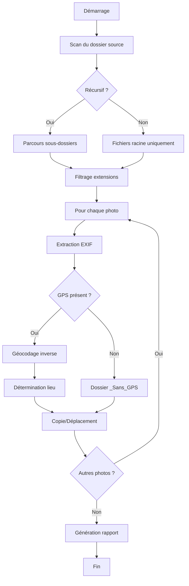

## Introduction

Vous avez des milliers de photos et vidéos accumulées au fil des années, éparpillées dans des dossiers sans logique apparente ? **Photo Geo Sorter v3.0** est un outil Python complet qui analyse les métadonnées EXIF/GPS de vos médias pour les organiser automatiquement par lieu géographique.

### Fonctionnalités principales

- **Support complet** : Photos JPEG, RAW (Canon, Nikon, Sony...) et vidéos géolocalisées
- **Génération JPEG** : Création automatique de versions JPEG pour les fichiers RAW
- **Détection de doublons** : Identification par hash MD5/SHA256 avec option d'exclusion
- **Génération de cartes** : Images PNG des lieux via OpenStreetMap (3 styles disponibles)
- **Clustering géographique** : Regroupe automatiquement les lieux proches
- **Tri par date** : Organisation par année/mois/jour en plus du lieu
- **Interface graphique** : GUI Tkinter complète pour tous les paramètres
- **Géocodage inverse** : Conversion des coordonnées en pays/région/ville
- **Cache intelligent** : Évite les appels API répétés
- **Rapport HTML interactif** : Dashboard avec graphiques Chart.js et carte globale

## Prérequis

- Python 3.8 ou supérieur
- Connexion Internet (pour le géocodage inverse)
- Tkinter (inclus avec Python, pour l'interface graphique)

Les dépendances s'installent automatiquement au premier lancement :
- **Pillow** : lecture des métadonnées EXIF des images standard
- **geopy** : géocodage inverse via Nominatim
- **exifread** : lecture des métadonnées des fichiers RAW

## Installation

### Méthode simple

Téléchargez le script et rendez-le exécutable :

```bash
chmod +x photo_geo_sorter.py
```

### Méthode recommandée (environnement virtuel)

```bash
# Création de l'environnement
python3 -m venv venv
source venv/bin/activate

# Installation des dépendances
pip install Pillow geopy

# Lancement
python photo_geo_sorter.py --help
```

## Utilisation

### Interface graphique (GUI)

Le moyen le plus simple d'utiliser l'application :

```bash
python photo_geo_sorter.py --gui
```

L'interface permet de :
- Sélectionner les dossiers source et destination
- Configurer toutes les options (RAW, date, clustering...)
- Lancer une simulation ou le tri réel
- Suivre la progression en temps réel

### Syntaxe en ligne de commande

```bash
python photo_geo_sorter.py <source> <destination> [options]
```

### Exemples courants

```bash
# Tri basique par lieu
python photo_geo_sorter.py ~/Photos ~/Photos_Triees

# Déplacer + rapport HTML
python photo_geo_sorter.py ~/Photos ~/Sorted --move --report

# Tri par lieu ET par date
python photo_geo_sorter.py ~/Photos ~/Sorted --sort-by-date

# Avec clustering géographique (5km par défaut)
python photo_geo_sorter.py ~/Photos ~/Sorted --clustering

# Clustering personnalisé (10km) + date
python photo_geo_sorter.py ~/Photos ~/Sorted --clustering --cluster-distance 10 --sort-by-date

# Simulation sans modification
python photo_geo_sorter.py ~/Photos ~/Sorted --dry-run --verbose
```

### Options disponibles

| Option | Raccourci | Description |
|--------|-----------|-------------|
| `--gui` | `-g` | Lance l'interface graphique |
| `--move` | `-m` | Déplacer les fichiers au lieu de les copier |
| `--dry-run` | `-n` | Simule l'opération sans modifier les fichiers |
| `--verbose` | `-v` | Affiche les détails de traitement |
| `--no-cache` | | Désactive le cache de géocodage |
| `--report` | `-r` | Génère un rapport HTML des résultats |

### Options fichiers RAW

| Option | Description |
|--------|-------------|
| `--no-raw` | Exclure les fichiers RAW du traitement |

**Formats RAW supportés** : `.cr2`, `.cr3` (Canon), `.nef` (Nikon), `.arw` (Sony), `.orf` (Olympus), `.rw2` (Panasonic), `.dng`, `.raf` (Fuji), `.pef` (Pentax), `.srw` (Samsung)

### Options de tri par date

| Option | Raccourci | Description |
|--------|-----------|-------------|
| `--sort-by-date` | `-D` | Active le tri par date en plus du lieu |
| `--date-structure` | | Structure des dossiers : `year`, `year-month`, `year-month-day` |

Avec `--sort-by-date`, la structure devient : `Lieu/Année/Année-Mois/photo.jpg`

### Options de clustering géographique

| Option | Raccourci | Description |
|--------|-----------|-------------|
| `--clustering` | `-C` | Active le regroupement des lieux proches |
| `--cluster-distance` | | Distance en km pour le clustering (défaut: 5) |

Le clustering regroupe automatiquement les photos prises dans un rayon défini sous un même dossier, évitant la multiplication de dossiers pour des lieux très proches.

### Détection de doublons

| Option | Description |
|--------|-------------|
| `--detect-duplicates` | Active la détection de doublons par hash |
| `--skip-duplicates` | Ignore les doublons (ne les copie/déplace pas) |
| `--hash-algorithm` | Algorithme : `md5` (rapide) ou `sha256` (sûr) |

La détection fonctionne en deux étapes :
1. Comparaison rapide par taille de fichier
2. Calcul du hash complet uniquement si tailles identiques

```bash
# Détecter et signaler les doublons
python photo_geo_sorter.py ~/Photos ~/Sorted --detect-duplicates

# Détecter ET ignorer les doublons
python photo_geo_sorter.py ~/Photos ~/Sorted --detect-duplicates --skip-duplicates
```

### Génération de cartes (GeoMap)

| Option | Description |
|--------|-------------|
| `--generate-maps` | Génère une image PNG de carte pour chaque lieu |
| `--map-style` | Style : `osm`, `carto-light`, `carto-dark` |
| `--map-zoom` | Niveau de zoom (défaut: 12) |

Pour chaque lieu détecté, une carte `_map.png` est générée dans le dossier correspondant. Une carte globale `_overview_map.png` avec tous les marqueurs est créée à la racine.

```bash
# Générer des cartes style sombre
python photo_geo_sorter.py ~/Photos ~/Sorted --generate-maps --map-style carto-dark

# Cartes avec zoom personnalisé
python photo_geo_sorter.py ~/Photos ~/Sorted --generate-maps --map-zoom 14
```

**Styles disponibles :**
- `osm` : OpenStreetMap standard (coloré)
- `carto-light` : CartoDB Light (minimaliste clair)
- `carto-dark` : CartoDB Dark (minimaliste sombre)

### Génération JPEG pour fichiers RAW

| Option | Description |
|--------|-------------|
| `--generate-jpeg` | Crée automatiquement un JPEG pour chaque RAW si absent |
| `--jpeg-quality` | Qualité JPEG de 1 à 100 (défaut: 85) |
| `--jpeg-max-size` | Taille max du côté le plus long en pixels (défaut: 2048) |

Cette fonctionnalité génère des versions JPEG pour **tous les fichiers RAW**, qu'ils aient des coordonnées GPS ou non. Avant de créer un nouveau JPEG, le script vérifie si une version existe déjà :
- Dans le dossier de destination
- Dans le dossier source original
- Avec différentes variantes de nom (`.jpg`, `.JPG`, `.jpeg`, `_preview.jpg`...)

```bash
# Générer des JPEG haute qualité
python photo_geo_sorter.py ~/Photos ~/Sorted --generate-jpeg --jpeg-quality 95

# JPEG plus petits pour le web
python photo_geo_sorter.py ~/Photos ~/Sorted --generate-jpeg --jpeg-max-size 1200 --jpeg-quality 80

# Tous les RAW auront un JPEG, même dans _Sans_GPS
python photo_geo_sorter.py ~/Photos ~/Sorted --generate-jpeg
```

**Convertisseurs supportés (par ordre de préférence) :**
1. **rawpy** (Python) - Installé automatiquement si possible
2. **dcraw** - Outil en ligne de commande
3. **darktable-cli** - Version CLI de Darktable
4. **ufraw-batch** - UFRaw batch mode

> **ℹ️ Note :** Pour de meilleurs résultats, installez `rawpy` via pip (`pip install rawpy`) ou `dcraw` via votre gestionnaire de paquets (`apt install dcraw`).

### Options récursives

| Option | Raccourci | Description |
|--------|-----------|-------------|
| `--no-recursive` | `-R` | Ne parcourt pas les sous-dossiers |
| `--max-depth N` | `-d N` | Profondeur max de récursion (-1 = illimité) |
| `--preserve-structure` | `-p` | Conserve l'arborescence source dans la destination |
| `--follow-symlinks` | `-L` | Suit les liens symboliques |
| `--exclude PATTERN` | `-e` | Exclut les dossiers matchant le pattern (répétable) |
| `--include-hidden` | | Inclut les fichiers/dossiers cachés |

### Exemples avancés

```bash
# NAS Synology : exclure les dossiers système
python photo_geo_sorter.py /volume1/photo ~/Sorted \
    -e "@eaDir" -e "#recycle" -e ".thumbnails"

# Limiter à 2 niveaux de sous-dossiers
python photo_geo_sorter.py ~/Photos ~/Sorted --max-depth 2

# Préserver la structure originale dans chaque lieu
# Résultat : France_Paris/Vacances2024/Jour1/photo.jpg
python photo_geo_sorter.py ~/Photos ~/Sorted --preserve-structure

# Scanner uniquement le dossier racine
python photo_geo_sorter.py ~/Photos ~/Sorted --no-recursive

# Inclure fichiers cachés et suivre les liens
python photo_geo_sorter.py ~/Photos ~/Sorted -L --include-hidden
```

## Structure de sortie

### Tri par lieu uniquement (défaut)

```
Photos_Triees/
├── France_Île-de-France_Paris/
│   ├── _map.png                 # Carte du lieu (si --generate-maps)
│   ├── IMG_2045.jpg
│   ├── DSC_0123.CR2
│   ├── DSC_0123.jpg             # JPEG généré (si --generate-jpeg)
│   └── VID_001.mp4
├── France_Bretagne_Brest/
│   ├── _map.png
│   ├── IMG_0042.NEF
│   ├── IMG_0042.jpg             # JPEG généré automatiquement
│   └── vacances_001.jpg
├── _Sans_GPS/
│   ├── scan_ancien.ARW
│   ├── scan_ancien.jpg          # JPEG généré même sans GPS !
│   └── screenshot.png
├── _overview_map.png            # Carte globale avec tous les lieux
└── rapport.html
```

### Tri par lieu + date (`--sort-by-date`)

```
Photos_Triees/
├── France_Île-de-France_Paris/
│   ├── _map.png
│   └── 2024/
│       ├── 2024-03/
│       │   └── IMG_2045.jpg
│       └── 2024-07/
│           └── DSC_0123.CR2
└── _Sans_GPS/
    └── _Date_Inconnue/
        └── screenshot.png
```

### Avec clustering (`--clustering`)

Les photos prises dans un rayon de 5km (par défaut) sont regroupées :

```
Photos_Triees/
├── France_Île-de-France_Paris/    # Regroupe Paris, Montmartre, Le Marais...
│   ├── _map.png                   # Carte centrée sur le barycentre
│   └── ...
└── France_Provence_Marseille/
    └── ...
```

## Formats supportés

### Images standard
- JPEG (`.jpg`, `.jpeg`)
- PNG (`.png`)
- TIFF (`.tiff`, `.tif`)
- HEIC/HEIF (`.heic`, `.heif`) — format Apple

### Fichiers RAW (avec `exifread`)
- Canon : `.cr2`, `.cr3`
- Nikon : `.nef`
- Sony : `.arw`
- Olympus : `.orf`
- Panasonic : `.rw2`
- Fujifilm : `.raf`
- Pentax : `.pef`
- Samsung : `.srw`
- Adobe DNG : `.dng`

### Vidéos géolocalisées
- MP4 (`.mp4`, `.m4v`)
- MOV (`.mov`) — Apple QuickTime
- AVI (`.avi`)
- MKV (`.mkv`)
- MTS/M2TS (`.mts`, `.m2ts`) — AVCHD
- 3GP (`.3gp`)

> **ℹ️ Note :** L'extraction GPS des vidéos fonctionne mieux avec `exiftool` installé. Sans lui, le script utilise `ffprobe` avec un support plus limité.

## Cache de géocodage

Pour éviter de surcharger l'API Nominatim et accélérer les traitements répétés, l'application maintient un cache local dans `~/.photo_geo_cache.json`.

Le cache utilise une précision de 3 décimales (~111 mètres), ce qui signifie que des photos prises au même endroit partageront le même résultat de géocodage.

Pour forcer un nouveau géocodage :

```bash
# Désactiver le cache temporairement
python photo_geo_sorter.py ~/Photos ~/Sorted --no-cache

# Ou supprimer le fichier cache
rm ~/.photo_geo_cache.json
```

## Code source complet

<details>
<summary><strong>🔽 Cliquez pour afficher le code source complet</strong></summary>

```python
#!/usr/bin/env python3
"""
Photo Geo Sorter - Tri de photos par géolocalisation
=====================================================
Extrait les coordonnées GPS des métadonnées EXIF et organise
les photos par lieu géographique.

Auteur: Gandalf / CyberMind
"""

import os
import sys
import shutil
import argparse
import json
from pathlib import Path
from datetime import datetime
from collections import defaultdict
from dataclasses import dataclass, field
from typing import Optional, Dict, List, Tuple
import hashlib

try:
    from PIL import Image
    from PIL.ExifTags import TAGS, GPSTAGS
except ImportError:
    print("Installation de Pillow...")
    os.system(f"{sys.executable} -m pip install Pillow --break-system-packages -q")
    from PIL import Image
    from PIL.ExifTags import TAGS, GPSTAGS

try:
    from geopy.geocoders import Nominatim
    from geopy.exc import GeocoderTimedOut, GeocoderServiceError
except ImportError:
    print("Installation de geopy...")
    os.system(f"{sys.executable} -m pip install geopy --break-system-packages -q")
    from geopy.geocoders import Nominatim
    from geopy.exc import GeocoderTimedOut, GeocoderServiceError

import time


@dataclass
class GeoLocation:
    """Représente une localisation géographique."""
    latitude: float
    longitude: float
    country: str = ""
    city: str = ""
    region: str = ""
    address: str = ""
    
    @property
    def folder_name(self) -> str:
        """Génère un nom de dossier sécurisé pour cette localisation."""
        parts = []
        if self.country:
            parts.append(self.country)
        if self.region:
            parts.append(self.region)
        if self.city:
            parts.append(self.city)
        
        if not parts:
            # Utilise les coordonnées si pas d'info
            return f"GPS_{self.latitude:.4f}_{self.longitude:.4f}"
        
        name = "_".join(parts)
        # Nettoie le nom pour le système de fichiers
        invalid_chars = '<>:"/\\|?*'
        for char in invalid_chars:
            name = name.replace(char, '_')
        return name[:100]  # Limite la longueur


@dataclass
class PhotoInfo:
    """Informations extraites d'une photo."""
    path: Path
    location: Optional[GeoLocation] = None
    date_taken: Optional[datetime] = None
    camera: str = ""
    
    @property
    def has_gps(self) -> bool:
        return self.location is not None


class GeoCache:
    """Cache pour les résultats de géocodage inverse."""
    
    def __init__(self, cache_file: Path = None):
        self.cache_file = cache_file or Path.home() / ".photo_geo_cache.json"
        self.cache: Dict[str, dict] = {}
        self._load_cache()
    
    def _load_cache(self):
        """Charge le cache depuis le fichier."""
        if self.cache_file.exists():
            try:
                with open(self.cache_file, 'r', encoding='utf-8') as f:
                    self.cache = json.load(f)
            except (json.JSONDecodeError, IOError):
                self.cache = {}
    
    def _save_cache(self):
        """Sauvegarde le cache dans le fichier."""
        try:
            with open(self.cache_file, 'w', encoding='utf-8') as f:
                json.dump(self.cache, f, ensure_ascii=False, indent=2)
        except IOError as e:
            print(f"⚠ Impossible de sauvegarder le cache: {e}")
    
    def _make_key(self, lat: float, lon: float, precision: int = 3) -> str:
        """Crée une clé de cache avec précision configurable."""
        return f"{lat:.{precision}f},{lon:.{precision}f}"
    
    def get(self, lat: float, lon: float) -> Optional[dict]:
        """Récupère une entrée du cache."""
        key = self._make_key(lat, lon)
        return self.cache.get(key)
    
    def set(self, lat: float, lon: float, data: dict):
        """Ajoute une entrée au cache."""
        key = self._make_key(lat, lon)
        self.cache[key] = data
        self._save_cache()


class PhotoGeoSorter:
    """Classe principale pour le tri de photos par géolocalisation."""
    
    SUPPORTED_EXTENSIONS = {'.jpg', '.jpeg', '.png', '.tiff', '.tif', '.heic', '.heif'}
    
    def __init__(self, 
                 source_dir: Path,
                 output_dir: Path,
                 copy_mode: bool = True,
                 verbose: bool = False,
                 use_cache: bool = True,
                 recursive: bool = True,
                 max_depth: int = -1,
                 preserve_structure: bool = False,
                 follow_symlinks: bool = False,
                 exclude_patterns: List[str] = None,
                 include_hidden: bool = False):
        """
        Initialise le trieur de photos.
        
        Args:
            source_dir: Dossier source contenant les photos
            output_dir: Dossier de destination pour les photos triées
            copy_mode: True pour copier, False pour déplacer
            verbose: Affiche plus de détails
            use_cache: Utilise le cache de géocodage
            recursive: Parcourir les sous-dossiers
            max_depth: Profondeur max (-1 = illimité)
            preserve_structure: Préserve l'arborescence source
            follow_symlinks: Suivre les liens symboliques
            exclude_patterns: Patterns de dossiers à exclure
            include_hidden: Inclure fichiers/dossiers cachés
        """
        self.source_dir = Path(source_dir)
        self.output_dir = Path(output_dir)
        self.copy_mode = copy_mode
        self.verbose = verbose
        self.recursive = recursive
        self.max_depth = max_depth
        self.preserve_structure = preserve_structure
        self.follow_symlinks = follow_symlinks
        self.exclude_patterns = exclude_patterns or []
        self.include_hidden = include_hidden
        
        self.geolocator = Nominatim(
            user_agent="photo_geo_sorter/1.0 (cybermind.consulting)",
            timeout=10
        )
        self.cache = GeoCache() if use_cache else None
        
        # Statistiques
        self.stats = {
            'total': 0,
            'with_gps': 0,
            'without_gps': 0,
            'processed': 0,
            'errors': 0,
            'skipped_dirs': 0,
            'locations': defaultdict(int)
        }
    
    def _log(self, message: str, verbose_only: bool = False):
        """Affiche un message selon le mode verbose."""
        if not verbose_only or self.verbose:
            print(message)
    
    def _convert_to_degrees(self, value) -> float:
        """Convertit les coordonnées EXIF en degrés décimaux."""
        try:
            d = float(value[0])
            m = float(value[1])
            s = float(value[2])
            return d + (m / 60.0) + (s / 3600.0)
        except (TypeError, IndexError, ZeroDivisionError):
            return 0.0
    
    def _extract_gps(self, exif_data: dict) -> Optional[Tuple[float, float]]:
        """Extrait les coordonnées GPS des données EXIF."""
        gps_info = {}
        
        for tag_id, value in exif_data.items():
            tag = TAGS.get(tag_id, tag_id)
            if tag == 'GPSInfo':
                for gps_tag_id, gps_value in value.items():
                    gps_tag = GPSTAGS.get(gps_tag_id, gps_tag_id)
                    gps_info[gps_tag] = gps_value
        
        if not gps_info:
            return None
        
        try:
            lat = self._convert_to_degrees(gps_info.get('GPSLatitude', []))
            lon = self._convert_to_degrees(gps_info.get('GPSLongitude', []))
            
            if gps_info.get('GPSLatitudeRef', 'N') == 'S':
                lat = -lat
            if gps_info.get('GPSLongitudeRef', 'E') == 'W':
                lon = -lon
            
            if lat == 0.0 and lon == 0.0:
                return None
            
            return (lat, lon)
        except Exception:
            return None
    
    def _extract_date(self, exif_data: dict) -> Optional[datetime]:
        """Extrait la date de prise de vue."""
        date_tags = ['DateTimeOriginal', 'DateTimeDigitized', 'DateTime']
        
        for tag_id, value in exif_data.items():
            tag = TAGS.get(tag_id, tag_id)
            if tag in date_tags and value:
                try:
                    return datetime.strptime(str(value), '%Y:%m:%d %H:%M:%S')
                except ValueError:
                    continue
        return None
    
    def _extract_camera(self, exif_data: dict) -> str:
        """Extrait les informations sur l'appareil photo."""
        make = ""
        model = ""
        
        for tag_id, value in exif_data.items():
            tag = TAGS.get(tag_id, tag_id)
            if tag == 'Make':
                make = str(value).strip()
            elif tag == 'Model':
                model = str(value).strip()
        
        if make and model:
            if make.lower() in model.lower():
                return model
            return f"{make} {model}"
        return make or model or "Unknown"
    
    def _reverse_geocode(self, lat: float, lon: float) -> GeoLocation:
        """Effectue un géocodage inverse pour obtenir l'adresse."""
        location = GeoLocation(latitude=lat, longitude=lon)
        
        # Vérifie le cache
        if self.cache:
            cached = self.cache.get(lat, lon)
            if cached:
                location.country = cached.get('country', '')
                location.city = cached.get('city', '')
                location.region = cached.get('region', '')
                location.address = cached.get('address', '')
                return location
        
        # Appel API avec gestion des erreurs
        for attempt in range(3):
            try:
                time.sleep(1.1)  # Respecte la limite de Nominatim (1 req/s)
                result = self.geolocator.reverse(
                    f"{lat}, {lon}",
                    language='fr',
                    exactly_one=True
                )
                
                if result and result.raw:
                    addr = result.raw.get('address', {})
                    location.country = addr.get('country', '')
                    location.city = (
                        addr.get('city') or 
                        addr.get('town') or 
                        addr.get('village') or 
                        addr.get('municipality', '')
                    )
                    location.region = (
                        addr.get('state') or 
                        addr.get('region') or 
                        addr.get('county', '')
                    )
                    location.address = result.address or ''
                    
                    # Met en cache
                    if self.cache:
                        self.cache.set(lat, lon, {
                            'country': location.country,
                            'city': location.city,
                            'region': location.region,
                            'address': location.address
                        })
                break
                
            except GeocoderTimedOut:
                self._log(f"  ⏱ Timeout, tentative {attempt + 1}/3...", True)
                time.sleep(2)
            except GeocoderServiceError as e:
                self._log(f"  ⚠ Erreur service: {e}", True)
                break
            except Exception as e:
                self._log(f"  ⚠ Erreur géocodage: {e}", True)
                break
        
        return location
    
    def analyze_photo(self, photo_path: Path) -> PhotoInfo:
        """Analyse une photo et extrait ses informations."""
        info = PhotoInfo(path=photo_path)
        
        try:
            with Image.open(photo_path) as img:
                exif_data = img._getexif()
                
                if exif_data:
                    # Extrait les coordonnées GPS
                    gps_coords = self._extract_gps(exif_data)
                    if gps_coords:
                        lat, lon = gps_coords
                        info.location = self._reverse_geocode(lat, lon)
                    
                    # Extrait la date
                    info.date_taken = self._extract_date(exif_data)
                    
                    # Extrait l'appareil photo
                    info.camera = self._extract_camera(exif_data)
                    
        except Exception as e:
            self._log(f"  ⚠ Erreur lecture EXIF: {e}", True)
        
        return info
    
    def _should_exclude_dir(self, dir_path: Path) -> bool:
        """Vérifie si un dossier doit être exclu."""
        import fnmatch
        dir_name = dir_path.name
        
        # Exclure les dossiers cachés si demandé
        if not self.include_hidden and dir_name.startswith('.'):
            return True
        
        # Vérifier les patterns d'exclusion
        for pattern in self.exclude_patterns:
            if fnmatch.fnmatch(dir_name, pattern):
                return True
            if fnmatch.fnmatch(str(dir_path), pattern):
                return True
        
        return False
    
    def _get_depth(self, path: Path) -> int:
        """Calcule la profondeur relative d'un chemin par rapport à la source."""
        try:
            relative = path.relative_to(self.source_dir)
            return len(relative.parts) - 1
        except ValueError:
            return 0
    
    def find_photos(self) -> List[Tuple[Path, Path]]:
        """
        Trouve toutes les photos dans le dossier source.
        
        Returns:
            Liste de tuples (chemin_photo, chemin_relatif_source)
        """
        photos = []
        
        def scan_directory(directory: Path, current_depth: int = 0):
            """Parcourt un dossier avec contrôle de profondeur."""
            try:
                entries = list(directory.iterdir())
            except PermissionError as e:
                self._log(f"⚠ Accès refusé: {directory}", True)
                return
            
            for entry in entries:
                # Gérer les liens symboliques
                if entry.is_symlink() and not self.follow_symlinks:
                    self._log(f"⊘ Lien ignoré: {entry}", True)
                    continue
                
                # Ignorer les fichiers cachés si demandé
                if not self.include_hidden and entry.name.startswith('.'):
                    continue
                
                if entry.is_file():
                    # Vérifier l'extension
                    if entry.suffix.lower() in self.SUPPORTED_EXTENSIONS:
                        try:
                            relative_path = entry.parent.relative_to(self.source_dir)
                        except ValueError:
                            relative_path = Path('.')
                        photos.append((entry, relative_path))
                
                elif entry.is_dir() and self.recursive:
                    # Vérifier l'exclusion
                    if self._should_exclude_dir(entry):
                        self.stats['skipped_dirs'] += 1
                        self._log(f"⊘ Dossier exclu: {entry.name}", True)
                        continue
                    
                    # Vérifier la profondeur
                    if self.max_depth >= 0 and current_depth >= self.max_depth:
                        self._log(f"⊘ Profondeur max atteinte: {entry}", True)
                        continue
                    
                    # Récursion
                    scan_directory(entry, current_depth + 1)
        
        # Mode non récursif
        if not self.recursive or self.max_depth == 0:
            for entry in self.source_dir.iterdir():
                if entry.is_file():
                    if not self.include_hidden and entry.name.startswith('.'):
                        continue
                    if entry.suffix.lower() in self.SUPPORTED_EXTENSIONS:
                        photos.append((entry, Path('.')))
        else:
            scan_directory(self.source_dir, 0)
        
        return sorted(photos, key=lambda x: x[0])
    
    def _get_unique_filename(self, dest_dir: Path, filename: str) -> Path:
        """Génère un nom de fichier unique si nécessaire."""
        dest_path = dest_dir / filename
        
        if not dest_path.exists():
            return dest_path
        
        base = dest_path.stem
        ext = dest_path.suffix
        counter = 1
        
        while dest_path.exists():
            dest_path = dest_dir / f"{base}_{counter}{ext}"
            counter += 1
        
        return dest_path
    
    def process_photo(self, photo_path: Path, info: PhotoInfo, 
                      relative_source: Path = None) -> bool:
        """Traite une photo (copie ou déplace vers le bon dossier)."""
        try:
            if info.has_gps:
                folder_name = info.location.folder_name
                self.stats['locations'][folder_name] += 1
            else:
                folder_name = "_Sans_GPS"
            
            # Construction du chemin de destination
            if self.preserve_structure and relative_source and str(relative_source) != '.':
                # Préserve la structure: lieu/structure_originale/fichier
                dest_dir = self.output_dir / folder_name / relative_source
            else:
                dest_dir = self.output_dir / folder_name
            
            dest_dir.mkdir(parents=True, exist_ok=True)
            
            dest_path = self._get_unique_filename(dest_dir, photo_path.name)
            
            if self.copy_mode:
                shutil.copy2(photo_path, dest_path)
            else:
                shutil.move(photo_path, dest_path)
            
            self.stats['processed'] += 1
            return True
            
        except Exception as e:
            self._log(f"  ✗ Erreur traitement: {e}")
            self.stats['errors'] += 1
            return False
    
    def run(self, dry_run: bool = False) -> dict:
        """
        Exécute le tri des photos.
        
        Args:
            dry_run: Si True, simule sans copier/déplacer
            
        Returns:
            Dictionnaire des statistiques
        """
        print(f"\n{'='*60}")
        print("📸 Photo Geo Sorter - Tri par géolocalisation")
        print(f"{'='*60}")
        print(f"📂 Source: {self.source_dir}")
        print(f"📁 Destination: {self.output_dir}")
        print(f"📋 Mode: {'Copie' if self.copy_mode else 'Déplacement'}")
        
        # Affichage des options récursives
        if self.recursive:
            depth_str = "illimitée" if self.max_depth < 0 else str(self.max_depth)
            print(f"🔄 Récursif: Oui (profondeur: {depth_str})")
        else:
            print(f"🔄 Récursif: Non")
        
        if self.preserve_structure:
            print(f"📁 Préservation structure: Oui")
        if self.exclude_patterns:
            print(f"🚫 Exclusions: {', '.join(self.exclude_patterns)}")
        if self.follow_symlinks:
            print(f"🔗 Liens symboliques: Suivis")
        if self.include_hidden:
            print(f"👁 Fichiers cachés: Inclus")
            
        if dry_run:
            print("🔍 MODE SIMULATION (dry-run)")
        print(f"{'='*60}\n")
        
        # Trouve les photos
        photos = self.find_photos()
        self.stats['total'] = len(photos)
        
        if not photos:
            print("❌ Aucune photo trouvée dans le dossier source.")
            if self.stats['skipped_dirs'] > 0:
                print(f"   ({self.stats['skipped_dirs']} dossiers exclus)")
            return self.stats
        
        print(f"📷 {len(photos)} photos trouvées")
        if self.stats['skipped_dirs'] > 0:
            print(f"   ({self.stats['skipped_dirs']} dossiers exclus)")
        print()
        
        # Crée le dossier de destination
        if not dry_run:
            self.output_dir.mkdir(parents=True, exist_ok=True)
        
        # Traite chaque photo
        for i, (photo_path, relative_source) in enumerate(photos, 1):
            relative_path = photo_path.relative_to(self.source_dir)
            print(f"[{i}/{len(photos)}] {relative_path}")
            
            info = self.analyze_photo(photo_path)
            
            if info.has_gps:
                self.stats['with_gps'] += 1
                loc = info.location
                self._log(f"  📍 {loc.city or 'N/A'}, {loc.country or 'N/A'}")
                self._log(f"     ({loc.latitude:.6f}, {loc.longitude:.6f})", True)
            else:
                self.stats['without_gps'] += 1
                self._log("  ⊘ Pas de données GPS")
            
            if info.date_taken:
                self._log(f"  📅 {info.date_taken.strftime('%d/%m/%Y %H:%M')}", True)
            
            if not dry_run:
                self.process_photo(photo_path, info, relative_source)
        
        # Affiche les statistiques
        self._print_stats()
        
        return self.stats
    
    def _print_stats(self):
        """Affiche les statistiques finales."""
        print(f"\n{'='*60}")
        print("📊 STATISTIQUES")
        print(f"{'='*60}")
        print(f"  Total photos analysées: {self.stats['total']}")
        print(f"  Avec GPS: {self.stats['with_gps']}")
        print(f"  Sans GPS: {self.stats['without_gps']}")
        print(f"  Traitées: {self.stats['processed']}")
        if self.stats['errors']:
            print(f"  Erreurs: {self.stats['errors']}")
        
        if self.stats['locations']:
            print(f"\n📍 LIEUX DÉTECTÉS:")
            for loc, count in sorted(self.stats['locations'].items(), 
                                      key=lambda x: -x[1]):
                print(f"  • {loc}: {count} photos")
        
        print(f"{'='*60}\n")


def generate_html_report(stats: dict, output_dir: Path):
    """Génère un rapport HTML des résultats."""
    html = f"""<!DOCTYPE html>
<html lang="fr">
<head>
    <meta charset="UTF-8">
    <meta name="viewport" content="width=device-width, initial-scale=1.0">
    <title>Rapport - Photo Geo Sorter</title>
    <style>
        * {{ margin: 0; padding: 0; box-sizing: border-box; }}
        body {{
            font-family: -apple-system, BlinkMacSystemFont, 'Segoe UI', Roboto, sans-serif;
            background: linear-gradient(135deg, #1a1a2e 0%, #16213e 100%);
            min-height: 100vh;
            color: #e8e8e8;
            padding: 2rem;
        }}
        .container {{
            max-width: 900px;
            margin: 0 auto;
        }}
        h1 {{
            font-size: 2.5rem;
            margin-bottom: 2rem;
            text-align: center;
            background: linear-gradient(90deg, #00d9ff, #00ff88);
            -webkit-background-clip: text;
            -webkit-text-fill-color: transparent;
        }}
        .stats-grid {{
            display: grid;
            grid-template-columns: repeat(auto-fit, minmax(200px, 1fr));
            gap: 1.5rem;
            margin-bottom: 2rem;
        }}
        .stat-card {{
            background: rgba(255,255,255,0.05);
            border-radius: 16px;
            padding: 1.5rem;
            text-align: center;
            border: 1px solid rgba(255,255,255,0.1);
            backdrop-filter: blur(10px);
        }}
        .stat-value {{
            font-size: 3rem;
            font-weight: bold;
            color: #00d9ff;
        }}
        .stat-label {{
            font-size: 0.9rem;
            color: #888;
            margin-top: 0.5rem;
        }}
        .locations {{
            background: rgba(255,255,255,0.05);
            border-radius: 16px;
            padding: 2rem;
            border: 1px solid rgba(255,255,255,0.1);
        }}
        .locations h2 {{
            margin-bottom: 1.5rem;
            color: #00ff88;
        }}
        .location-item {{
            display: flex;
            justify-content: space-between;
            padding: 0.75rem 0;
            border-bottom: 1px solid rgba(255,255,255,0.05);
        }}
        .location-item:last-child {{
            border-bottom: none;
        }}
        .location-name {{
            display: flex;
            align-items: center;
            gap: 0.5rem;
        }}
        .location-count {{
            background: rgba(0,217,255,0.2);
            padding: 0.25rem 0.75rem;
            border-radius: 20px;
            font-size: 0.85rem;
        }}
        .bar {{
            height: 8px;
            background: linear-gradient(90deg, #00d9ff, #00ff88);
            border-radius: 4px;
            margin-top: 0.5rem;
        }}
        footer {{
            text-align: center;
            margin-top: 2rem;
            color: #666;
            font-size: 0.85rem;
        }}
    </style>
</head>
<body>
    <div class="container">
        <h1>📸 Photo Geo Sorter</h1>
        
        <div class="stats-grid">
            <div class="stat-card">
                <div class="stat-value">{stats['total']}</div>
                <div class="stat-label">Photos analysées</div>
            </div>
            <div class="stat-card">
                <div class="stat-value">{stats['with_gps']}</div>
                <div class="stat-label">Avec GPS</div>
            </div>
            <div class="stat-card">
                <div class="stat-value">{stats['without_gps']}</div>
                <div class="stat-label">Sans GPS</div>
            </div>
            <div class="stat-card">
                <div class="stat-value">{len(stats['locations'])}</div>
                <div class="stat-label">Lieux détectés</div>
            </div>
        </div>
        
        <div class="locations">
            <h2>📍 Lieux détectés</h2>
"""
    
    if stats['locations']:
        max_count = max(stats['locations'].values())
        for loc, count in sorted(stats['locations'].items(), key=lambda x: -x[1]):
            percentage = (count / max_count) * 100
            html += f"""
            <div class="location-item">
                <div class="location-name">
                    <span>📌</span>
                    <span>{loc}</span>
                </div>
                <div class="location-count">{count} photos</div>
            </div>
            <div class="bar" style="width: {percentage}%"></div>
"""
    else:
        html += "<p>Aucun lieu détecté</p>"
    
    html += f"""
        </div>
        
        <footer>
            Généré le {datetime.now().strftime('%d/%m/%Y à %H:%M')} par Photo Geo Sorter
        </footer>
    </div>
</body>
</html>"""
    
    report_path = output_dir / "rapport_tri_photos.html"
    with open(report_path, 'w', encoding='utf-8') as f:
        f.write(html)
    
    return report_path


def main():
    parser = argparse.ArgumentParser(
        description="Trie les photos par lieu géographique basé sur les données GPS EXIF",
        formatter_class=argparse.RawDescriptionHelpFormatter,
        epilog="""
Exemples:
  %(prog)s /chemin/vers/photos /chemin/vers/sortie
  %(prog)s ~/Photos ~/Photos_Triees --move
  %(prog)s . ./sorted --dry-run --verbose
  
  # Options récursives:
  %(prog)s ~/Photos ~/Sorted -R                    # Sans récursion
  %(prog)s ~/Photos ~/Sorted --max-depth 2         # Max 2 niveaux
  %(prog)s ~/Photos ~/Sorted -p                    # Préserve structure
  %(prog)s ~/Photos ~/Sorted -e "@eaDir" -e "cache" # Exclure dossiers
  %(prog)s ~/Photos ~/Sorted -L --include-hidden   # Liens + cachés
        """
    )
    
    parser.add_argument('source', type=Path, help="Dossier source contenant les photos")
    parser.add_argument('destination', type=Path, help="Dossier de destination")
    parser.add_argument('--move', '-m', action='store_true', 
                        help="Déplacer les fichiers au lieu de les copier")
    parser.add_argument('--dry-run', '-n', action='store_true',
                        help="Simule sans copier/déplacer les fichiers")
    parser.add_argument('--verbose', '-v', action='store_true',
                        help="Affiche plus de détails")
    parser.add_argument('--no-cache', action='store_true',
                        help="Désactive le cache de géocodage")
    parser.add_argument('--report', '-r', action='store_true',
                        help="Génère un rapport HTML")
    
    # Options récursives
    recursive_group = parser.add_argument_group('Options récursives')
    recursive_group.add_argument('--no-recursive', '-R', action='store_true',
                        help="Ne pas parcourir les sous-dossiers (défaut: récursif)")
    recursive_group.add_argument('--max-depth', '-d', type=int, default=-1, metavar='N',
                        help="Profondeur max de récursion (-1 = illimité, 0 = source seulement)")
    recursive_group.add_argument('--preserve-structure', '-p', action='store_true',
                        help="Préserve la structure des sous-dossiers dans la destination")
    recursive_group.add_argument('--follow-symlinks', '-L', action='store_true',
                        help="Suivre les liens symboliques")
    recursive_group.add_argument('--exclude', '-e', action='append', default=[], metavar='PATTERN',
                        help="Exclure les dossiers correspondant au pattern (peut être répété)")
    recursive_group.add_argument('--include-hidden', action='store_true',
                        help="Inclure les fichiers/dossiers cachés (commençant par .)")
    
    args = parser.parse_args()
    
    if not args.source.exists():
        print(f"❌ Erreur: Le dossier source n'existe pas: {args.source}")
        sys.exit(1)
    
    sorter = PhotoGeoSorter(
        source_dir=args.source,
        output_dir=args.destination,
        copy_mode=not args.move,
        verbose=args.verbose,
        use_cache=not args.no_cache,
        recursive=not args.no_recursive,
        max_depth=args.max_depth,
        preserve_structure=args.preserve_structure,
        follow_symlinks=args.follow_symlinks,
        exclude_patterns=args.exclude,
        include_hidden=args.include_hidden
    )
    
    stats = sorter.run(dry_run=args.dry_run)
    
    if args.report and not args.dry_run and stats['processed'] > 0:
        report_path = generate_html_report(stats, args.destination)
        print(f"📄 Rapport généré: {report_path}")


if __name__ == "__main__":
    main()
```

</details>

## Architecture du code

Le script est organisé autour de plusieurs classes :

### Classes de données

```python
@dataclass
class GeoLocation:
    """Représente une localisation géographique."""
    latitude: float
    longitude: float
    country: str = ""
    city: str = ""
    region: str = ""
    address: str = ""

@dataclass
class PhotoInfo:
    """Informations extraites d'une photo."""
    path: Path
    location: Optional[GeoLocation] = None
    date_taken: Optional[datetime] = None
    camera: str = ""
```

### Classe GeoCache

Gère la persistance des résultats de géocodage :

```python
class GeoCache:
    def get(self, lat: float, lon: float) -> Optional[dict]
    def set(self, lat: float, lon: float, data: dict)
```

### Classe PhotoGeoSorter

Classe principale orchestrant le traitement :

```python
class PhotoGeoSorter:
    def find_photos(self) -> List[Tuple[Path, Path]]
    def analyze_photo(self, photo_path: Path) -> PhotoInfo
    def process_photo(self, photo_path: Path, info: PhotoInfo) -> bool
    def run(self, dry_run: bool = False) -> dict
```

## Diagramme de flux



## Limites et considérations

### Limites de l'API Nominatim

Le service Nominatim d'OpenStreetMap impose des restrictions :
- Maximum 1 requête par seconde
- User-Agent obligatoire
- Usage commercial limité

Le script respecte ces contraintes avec un délai de 1.1 seconde entre chaque requête et un système de cache.

### Photos sans GPS

Certaines photos n'ont pas de données GPS :
- Photos d'appareils anciens
- GPS désactivé sur le smartphone
- Captures d'écran et images téléchargées
- Photos dont les métadonnées ont été supprimées

### Précision du géocodage

La précision dépend de la qualité des données OpenStreetMap pour la zone concernée. Les zones rurales peuvent avoir des résultats moins précis que les zones urbaines.

## Évolutions possibles

- [ ] Export vers Google Earth (KML/KMZ)
- [ ] Intégration avec des services photos (Google Photos, iCloud)
- [ ] Mode serveur web avec interface REST
- [ ] Reconnaissance faciale pour tri par personne
- [ ] Génération de cartes interactives (Leaflet)

## Ressources

- [Documentation Pillow/PIL](https://pillow.readthedocs.io/)
- [Documentation geopy](https://geopy.readthedocs.io/)
- [Spécification EXIF](https://www.exif.org/Exif2-2.PDF)
- [API Nominatim](https://nominatim.org/release-docs/latest/api/Overview/)

## Licence

Ce script est distribué sous licence MIT. Libre à vous de l'utiliser, le modifier et le redistribuer.

---

*Développé par Gandalf / CyberMind Consulting*
