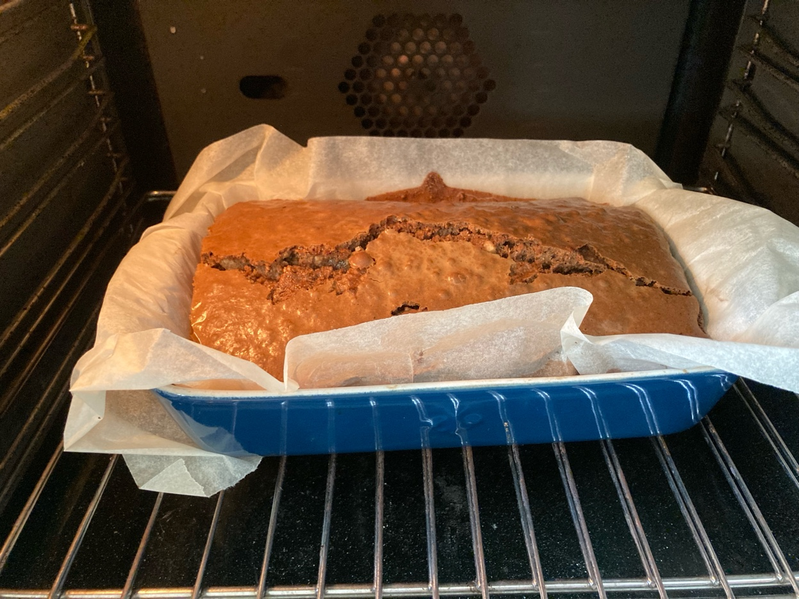
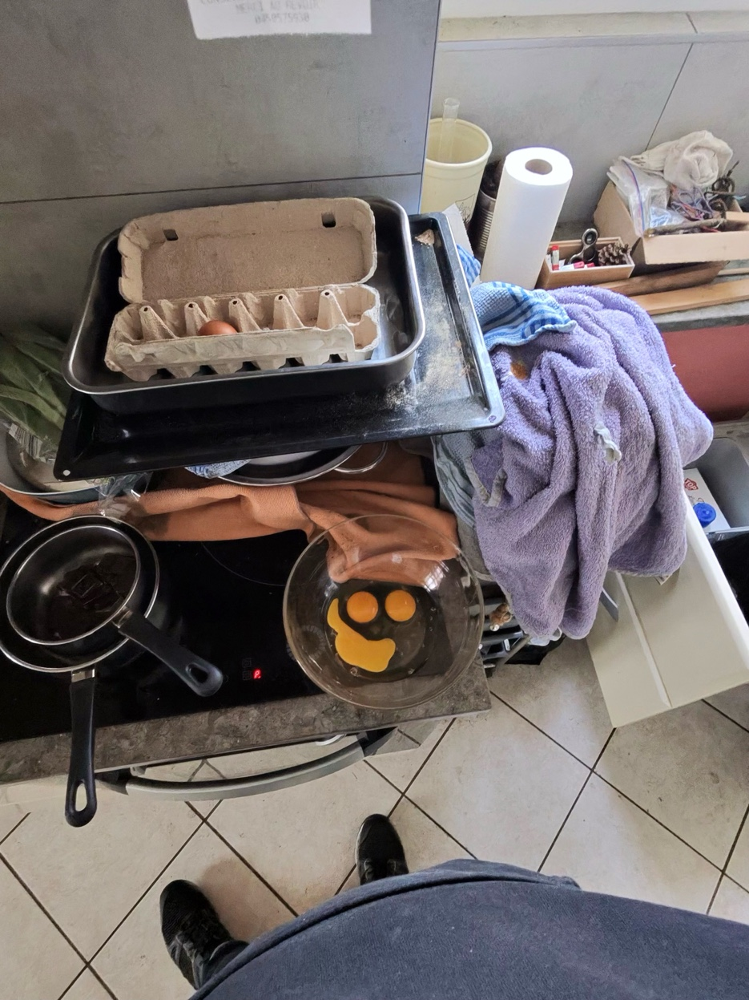
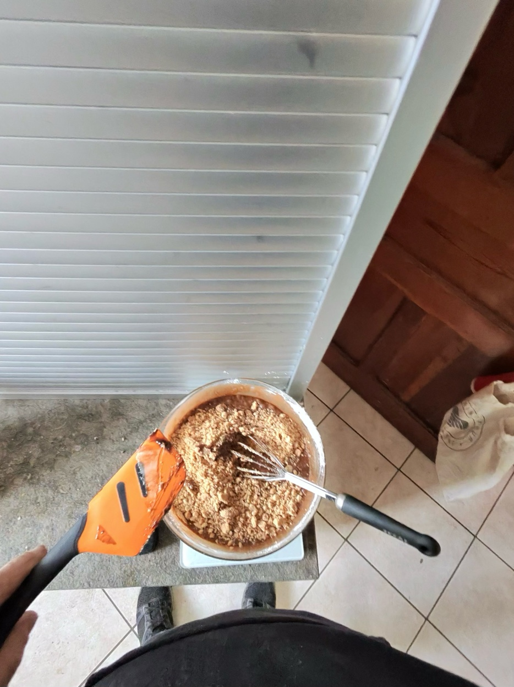

<link href="https://fonts.googleapis.com/css2?family=Playfair+Display:ital,wght@0,400;0,700;0,900;1,400&family=Crimson+Text:ital,wght@0,400;0,600;1,400&family=Bebas+Neue&display=swap" rel="stylesheet">

<header class="magazine-header">

La Cuisine de Maurienne

Les recettes authentiques du terroir alpin

</header>
<section class="title-section">

✦ Recette Originale ✦

<h1 class="main-title">Nuggetsd'Écureuil</h1>

Petits carrés fondants choco-cacahuète

🐿️
</section>

🕐 25-30 MIN
🔥 180°C
🍫 28 PIÈCES
⭐ FACILE

Sortie du four, croustillant à souhait !

1

2

<h2 class="section-title">Ingrédients</h2>
<ul class="ingredients-list">
<li><strong>225 g</strong> de beurre</li>
<li><strong>115 g</strong> de chocolat noir</li>
<li><strong>4</strong> œufs entiers</li>
<li><strong>300 g</strong> de sucre semoule</li>
<li><strong>115 g</strong> de farine</li>
<li><strong>1 c.</strong> à café de vanille</li>
<li><strong>200 g</strong> de cacahuètes moulues</li>
</ul>

<section class="preparation-section">
<h2 class="prep-title">Préparation</h2>

1

Préparation

Préchauffer le four à 180°C. Beurrer un moule de 22,5 × 30 cm.

2

Bain-marie

Faire fondre au bain-marie le beurre et le chocolat. Retirer et laisser tiédir.

3

Mélange

Fouetter œufs et sucre jusqu'à obtenir un mélange pâle et mousseux. Ajouter la vanille.

4

Incorporation

Incorporer le chocolat fondu avec le beurre, bien mélanger intimement.

5

Finition

Tamiser et incorporer la farine. Ajouter les cacahuètes moulues en dernier.

6

Cuisson

Verser dans le moule. Cuire 25 min. Laisser refroidir 30 min puis découper.

</section>

💡

<strong>SECRET DU CHEF :</strong> Le milieu doit être tout juste cuit ! Un nugget légèrement sous-cuit au centre sera parfaitement fondant une fois refroidi. Attention à ne pas dessécher la pâte.

<footer class="magazine-footer">

Bon Appétit !

RECETTE MAISON • COLLECTION GOURMANDE

</footer>

